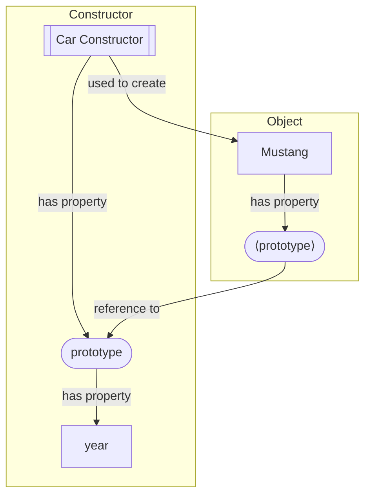

If you think about a prototype in general, its usually a model of something that's usually built to test or demonstrate functionality. A car manufacturer might build a prototype of a new model which shows the general shape, color, what the lights look like, what the interior looks like, e.c.t. But the prototype isn't a finished product; it can't be driven.

<br />

The JavaScript (or ECMAScript) language makes use of prototypes where other languages such as PHP or Python make use of classes. Even though JavaScript has the _class_ keyword, this is just an abstraction (or syntactic sugar) over prototypes. In an OOP language, classes are used as a sort of blueprint to create objects. Class can build off each other and inherit methods and properties. Prototypes fill a similar role in JavaScript, but work quite differently to classes.

## How do Prototypes work?

In the car manufacturer example, the prototype is essentially a model that the real product is based off. In JavaScript, a prototype is an object that can be used as a basis for building other objects. Look at the following example:

```javascript
function Car(modelName, color) {
  this.modelName = modelName;
  this.color = color;
}
```

Nothing new there. We're creating a constructor function called "Car". The constructor function is called with two arguments, modelName and color. We can now use the constructor function to create a new object:

```javascript
const mustang = new Car("Mustang", "Gun Metal Gray");
```

Now let's say you wanted to add a new property that all instances of "Car" will have, something like this:

```javascript
Car.price = 90000;
```

Now lets try and access the "price" property on the "mustang" object. Notice you get an undefined error. This makes sense, because you've already created the "mustang" object before adding the "price" property to the "Car" function. So, lets create a new object using the constructor function:

```javascript
const saab = new Car("Saab", "Beige").
```

Now let's try accessing the "price" property on the "saab" object. We still get an undefined error. To show how to make this work, let's add a "year" property to the "Car" function's prototype property before looking at what the prototype actually is:

```javascript
Car.prototype.year = 2021;
```

Trying to access "year" property on either the "mustang" or "saab" object returns 2021. Why does this work? What is the **prototype** property?

## The Prototype property

**Prototype** is a property that exists in on every function. Wait, objects have properties, so why does a function have a property? Well in JavaScript, as the saying goes, "everything is an object". Well not everything, JavaScript has a number of primitive data types that are not objects. But apart from these, everything is an object.

<br />

When you define a function, you are creating a new instance of a Function object (Function is built into JavaScript). Functions defined with the _function_ keyword, are created with a **prototype** property. This prototype is itself an object.

<br />

To understand this better, let's log the "Car" constructor function to the console:

```javascript
function Car(modelName, color)
  arguments: null
  caller: null
  length: 2
  name: "Car"
  prototype: Object { year: 2021, … }
  price: 90000
  <prototype>: function ()
```

As you can see, the Car function is an object with it's own properties, including the "price" property we added to it. This explains why trying to access the "price" property on both the "mustang" and "saab" objects didn't work: we added the property to the "Car" function (actually an object). Recall also that we then added a "year" property to the "Car" function's **prototype** property. Let's expand the prototype property in the console:

```javascript
prototype: Object { year: 2021, … }
  constructor: function Car(modelName, color)
  year: 2021​​
  <prototype>: Object { … }
```

So, you added a property to an object that is itself a property on the "Car" constructor function. Well, nested objects are quite common. But since the "year" property is a nested property on the "Car" function, why can we access it on the "mustang" or "saab" objects? To answer that, let's log the "mustang" object to the console:

```javascript
Object { modelName: "Mustang", color: "Gun Metal Gray" }
  color: "Gun Metal Gray"
  modelName: "Mustang"
​ <prototype>: Object { year: 2021, … }
```

What is the **`<prototype>`** property on the "mustang" object? Let's expand it in the console:

```javascript
<prototype>: Object { year: 2021, … }
  constructor: function Car(modelName, color)
  year: 2021
  <prototype>: Object { … }
```

So the **`<prototype>`** property on the 'mustang' object is an object that has the same properties as the **prototype** property on the 'Car' function. So this explains why you can access the 'year' property on the 'mustang' object. But it raises another question: since we created the 'mustang' object BEFORE adding the 'year' property to the 'Car' function's **prototype**, why does the 'year' property exist on the 'mustang' object's **`<prototype>`** object?

<br />

The answer is that the **`<prototype>`** property on the 'mustang' object isn't actually a separate object that is a copy of the "Car" function's prototype, but rather a **reference** to it. In other words, whenever you try and access an object's **`<prototype>`**, it will always reference the current value of that object's prototype.

<br />

So let's recap:

- In JavaScript, functions are objects
- Functions declared with the 'function' keyword contain a property called **prototype**
- Objects created via a constructor function contain a **`<prototype>`** property that is a reference to the constructor's **prototype** property
- To add a property or method that all objects created with the constructor inherit, add the property or method to the constructor's prototype
- Or if you are a more visual person:



## The Prototype Chain and Inheritance

What we've looked as so far is how we can utilize prototypes in creating our own objects as a collection for all the properties and methods we want our objects to inherit. But prototypes are built into the JavaScript lanaguage itself. WIP
